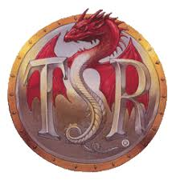

{ align=left width="300" loading=lazy }

# Home

I am a recent graduate of University of Wisconsin-Madison majoring in Physics, Astronomy-Physics, and Computer Science.

My interests include particle astrophysics, specifically neutrino physics pursuing study of neutrino oscillations, high energy physics, and dark matter. Outside of physics I love to code fun side projects and build things. See below for some of my research. I also have an interest in graphic design and try to consider good design principles as much as I can when designing two mobile apps and a website I'm working on.

 

## Contact Info

Email: [decheine@hep.wisc.edu](mailto:decheine@hep.wisc.edu)

## CV

[Link to my CV](/files/CV_v1.3.pdf)

## Research

### MiniCLEAN Dark Matter Experiment

I presented my research on the direct dark matter detection experiment MiniCLEAN as an infographic poster presentation at the University of Wisconsin—Madison 2018 Undergraduate Symposium.

> Abstract: MiniCLEAN is a direct dark matter detection experiment located in SNOLAB, 2km underground near Sudbury Ontario Canada. It is a technology demonstrator for the detection of nuclear recoils from Weakly Interacting Massive Particles (WIMPS), a likely candidate particle for dark matter. For this experiment, Reactor Analysis Tool (RAT), a Monte Carlo simulation tool for liquid scintillator detectors that relies on particle interactions in Geant4 software, is used to simulate the detector environment. We primarily study signal recoil calibrations and background events. I studied the effect of upgrading Geant4 from version 9 to 10 to help decide whether the MiniCLEAN version of RAT should upgrade. In key physical simulations, the outputs of the two versions are consistent and the newer Geant4 version shows better performance.

[Link to Poster PDF](/files/SymposiumPosterFinal.pdf)

### Ricochet Simulations and Software Docs

As part of an independent study my senior year, I wrote and ran simulations for Ricochet, a collaboration developing the Ricochet neutrino detector, using Geant4-based simulation software (ricochetsim) developed by collaboration scientists.
I Developed a software documentation site for the collaboration to use, using MkDocs for static site generation and GitLab CI/CD for hosting the site.
For an independent study/thesis project, I designed and implemented a class data structure in C++ for modelling the detector’s electronic response that interfaces with existing ricochetsim event classes, bundled in an application I called Ricochet Detector Electronic Response (RDER).
I laid the ground work for the data structures for the simulation chain, going from Geant4 energy deposits to waveforms to electronics to digitization.

[Open the website in a new tab.](https://decheine.gitlab.io/mkdocs/)

### IRIS-HEP Fellowship

{ align=left width="200" loading=lazy }

Over the summer of 2021, I was accepted to the IRIS-HEP Fellowship to work on a software project. I created a C++ library called and demo program called XDataFrame to connect ServiceX physics experiment data delivery as a data source for ROOT’s RDataFrame. Go to my page to see more information and my talk

[Fellowship Page](https://iris-hep.org/fellows/decheine.html){align=right .md-button .md-button--primary}

## Side Projects

### AD&D 2nd Edition Complete Monstrous Index Resurrection

{ align=left width="200" loading=lazy}

Many years ago in high school, my friends and I stumbled across a wonderful site by some guy called lomion.de. This website had every monster in Advanced Dungeons & Dragons 2nd Edition, across over 100 source books, with over 2,000 monsters. But sadly in 2016 the site went dark, but it was indexed by the Wayback Machine. With the Wayback Machine, some data tools, lots of regex, and hacky solutions, I resurrected the website. Now I am embarking on a mission to fill out missing gaps the previous author had, and extract all the data from the raw HTML pages into a manageable format like into JSON files. With a custom schema and database of 2nd edition monsters, there are tons of ways it could be used like in website to filter them by their stats.

The full barebones index is already live. However I intend to create a full stack deployment protocol for this project, contructing the website from database entries (with links to original html files too). The website will also include pages where you can browse all of the monster books and sources, browse by setting, and searching functionality. The backend will likely be a Firebase Firestore database for data to search through. The website proper is built with React. A huge part of this project was creating the data extractor to extract monster data from over 2,000 files and store it in a data structure. This was done in C++ for it's speed, and utilizes some janky regex patterns and lots of methods to handle all the different kinds of elements in the monster pages.

My GitHub repository [decheine/lomion-de](https://github.com/decheine/lomion-de) hosts the program I’m writing in C++ to extract the data. The the button to go to my live index.

[Monster Indesx]
